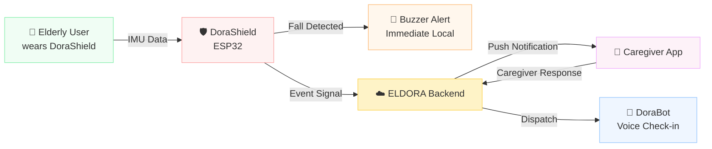
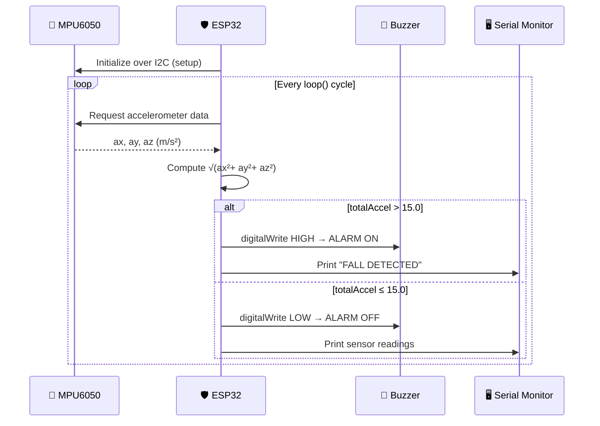

<div align="center">

# 🛡️ DoraShield — ELDORA Fall Detection Wearable

### *Protect. Respond. Recover.*

[](https://www.espressif.com/)
[](https://www.arduino.cc/)
[](https://invensense.tdk.com/)
[](https://github.com/)
[](LICENSE)
[](https://github.com/)

<br/>

**ESP32 firmware for the ELDORA DoraShield — a wearable fall-detection device that continuously monitors acceleration, detects strong impact events, and triggers an immediate local buzzer alert to protect elderly users.**

[🌐 ELDORA Ecosystem](https://github.com/eldora-bm) · [🤖 DoraBot](https://github.com/eldora-bm/dorabot) · [📱 ELDORA App](https://github.com/eldora-bm/eldora-app)

</div>

---

## 📌 Overview

DoraShield is the **first line of defense** in the ELDORA eldercare ecosystem. Worn on the body, it continuously reads inertial data from the MPU6050 accelerometer/gyroscope and triggers an immediate local buzzer alert the moment a fall or strong impact is detected — no internet connection required for the core safety response.

> **DoraShield's role in the ELDORA ecosystem:**
> *"The wearable guardian — always on, always measuring, always ready to raise the alarm before anyone even realizes something happened."*

| | |
|---|---|
| **MCU** | ESP32 |
| **IMU Sensor** | MPU6050 (I2C) — 3-axis accelerometer + 3-axis gyroscope |
| **Alert Output** | Active buzzer (GPIO-driven) |
| **Detection Method** | Total acceleration vector magnitude threshold |
| **Power** | Li-ion battery + power module |
| **Response Latency** | Real-time (continuous polling loop) |

---

## 🌐 ELDORA Ecosystem

DoraShield is the **Protect** layer of ELDORA's three-phase safety framework:

```
ELDORA Ecosystem
├── 🛡️  DoraShield   — Fall detection wearable (this repo — ESP32)
├── 🤖  DoraBot       — AI voice companion (ESP32-S3)
└── 📱  ELDORA App    — Caregiver dashboard (XGBoost + SHAP, Isolation Forest)
```



---

## ✨ Firmware Features

- 📡 **MPU6050 Initialization** — configures the IMU over I2C on boot with error checking
- 🔄 **Continuous Acceleration Reading** — polls 3-axis accelerometer data in the main loop
- 📐 **Total Acceleration Vector Calculation** — computes resultant magnitude from X, Y, Z axes
- 💥 **Fall / Impact Detection** — triggers alert when magnitude exceeds the configured threshold
- 🔔 **Local Buzzer Alert** — activates buzzer immediately on detection, deactivates when motion normalizes
- 🖥️ **Serial Monitor Output** — streams live sensor values and alarm state for debugging and threshold tuning

---

## 🛠️ Tech Stack

| Layer | Technology | Purpose |
|---|---|---|
| **MCU** | ESP32 | Main processor, I2C master, GPIO control |
| **Framework** | Arduino (ESP-IDF) | Firmware development environment |
| **IMU Driver** | Adafruit MPU6050 | I2C communication and sensor abstraction |
| **Sensor Abstraction** | Adafruit Unified Sensor | Standardized sensor event interface |
| **I2C Bus** | Wire | Arduino I2C protocol library |
| **Debug Output** | Serial Monitor (115200 baud) | Live sensor data + alarm state logging |

---

## 🔧 Hardware

| Component | Model / Spec | Role |
|---|---|---|
| **Microcontroller** | ESP32 | Main firmware host, I2C master |
| **IMU** | MPU6050 | 3-axis accelerometer + 3-axis gyroscope |
| **Alert** | Active buzzer | Immediate local fall alarm output |
| **Power** | Li-ion battery + power module | Portable wearable power supply |

### Pin Configuration

Defined in `FallDetection.ino`:

| Pin | GPIO | Connected To |
|---|---|---|
| I2C SDA | **GPIO 4** | MPU6050 SDA |
| I2C SCL | **GPIO 5** | MPU6050 SCL |
| Buzzer | **GPIO 3** | Active buzzer signal |

> ⚠️ If you rewire the hardware, update the `#define` constants at the top of `FallDetection.ino` to match your new pin assignments before flashing.

---

## 📁 Project Structure

```
DoraShield/
│
└── 📄 FallDetection.ino     # Complete firmware — MPU6050 init, read loop,
                             # vector calculation, threshold check, buzzer control
```

<details>
<summary><b>Why it's a single file</b></summary>

<br/>

DoraShield's firmware is intentionally minimal and self-contained. The entire detection pipeline — sensor init, data read, math, alert output, serial logging — fits cleanly in one Arduino sketch, making it straightforward to flash, audit, and tune. There are no hidden dependencies between files or initialization order surprises.

</details>

---

## ⚙️ How DoraShield Works



**In plain English:**
```
DoraShield boots → initializes MPU6050 over I2C
    → enters continuous loop:
        reads ax, ay, az from MPU6050
        computes total acceleration magnitude
        if magnitude > threshold → buzzer ON  (fall detected)
        else                     → buzzer OFF (normal motion)
        streams readings to Serial Monitor
```

---

## 🔬 Fall Detection Logic

The core detection is a **total acceleration vector magnitude** check:

```cpp
// Read accelerometer axes (m/s²)
sensors_event_t accel, gyro, temp;
mpu.getEvent(&accel, &gyro, &temp);

float ax = accel.acceleration.x;
float ay = accel.acceleration.y;
float az = accel.acceleration.z;

// Compute resultant magnitude
float totalAccel = sqrt(ax*ax + ay*ay + az*az);

// Threshold-based fall detection
if (totalAccel > 15.0) {
  digitalWrite(BUZZER_PIN, HIGH);  // FALL / IMPACT detected
} else {
  digitalWrite(BUZZER_PIN, LOW);   // Normal motion
}
```

### Why total magnitude?

A fall produces a characteristic **impact spike** — a sudden surge in resultant acceleration across all axes simultaneously — regardless of the wearable's orientation. Using the vector magnitude instead of individual axes makes the detector **orientation-agnostic**, so it works whether DoraShield is worn on the wrist, chest, or clipped to a belt.

<details>
<summary><b>Tuning the threshold</b></summary>

<br/>

The default threshold of `15.0 m/s²` is a starting point. To tune it for real-world accuracy:

| Step | Action |
|---|---|
| 1 | Open Serial Monitor at `115200 baud` |
| 2 | Have the wearer perform normal activities (walking, sitting, standing up) |
| 3 | Note the peak `totalAccel` values during normal motion |
| 4 | Simulate a controlled fall onto a soft surface and note the spike value |
| 5 | Set threshold between the highest normal-motion peak and the lowest fall spike |

**General guidance:**

| Scenario | Typical totalAccel |
|---|---|
| Standing still | ~9.8 m/s² (gravity only) |
| Walking | 10–13 m/s² |
| Sitting down quickly | 12–14 m/s² |
| Fall / hard impact | **> 15–25 m/s²** |

A threshold too low → false positives on vigorous movement. Too high → missed falls. Tune per user and wearable placement.

</details>

<details>
<summary><b>Extending the detection algorithm</b></summary>

<br/>

The current firmware uses a simple single-threshold check. More robust approaches to consider:

| Enhancement | Description |
|---|---|
| **Free-fall pre-phase** | Detect a brief near-zero-g window (< ~2 m/s²) before the impact spike — characteristic of true falls |
| **Gyroscope fusion** | Add angular velocity check: falls often produce rapid rotation on at least one axis |
| **Debounce window** | Require the threshold to be exceeded for N consecutive samples before triggering |
| **TinyLSTM (future)** | Replace threshold logic with a trained time-series classifier for higher precision |

The ELDORA roadmap targets a **TinyLSTM model on ESP32** as the next detection layer for reduced false positives.

</details>

---

## ⚙️ Configuration

Update the following constants in `FallDetection.ino` before flashing:

```cpp
// ── Hardware Pins ─────────────────────────────────────────
#define SDA_PIN       4       // MPU6050 I2C data
#define SCL_PIN       5       // MPU6050 I2C clock
#define BUZZER_PIN    3       // Active buzzer output

// ── Detection Threshold ───────────────────────────────────
#define FALL_THRESHOLD  15.0  // m/s² — tune after real-world testing

// ── Serial Debug ──────────────────────────────────────────
#define SERIAL_BAUD   115200
```

---

## 🚀 Build & Flash

### Prerequisites

- [Arduino IDE 2.x](https://www.arduino.cc/en/software) with ESP32 board support installed
- ESP32 board package URL: `https://raw.githubusercontent.com/espressif/arduino-esp32/gh-pages/package_esp32_index.json`

### Required Libraries

Install via Arduino Library Manager (`Sketch → Include Library → Manage Libraries`):

| Library | Install Name | Purpose |
|---|---|---|
| `Wire` | *(bundled with ESP32 core)* | I2C bus communication |
| `Adafruit MPU6050` | `Adafruit MPU6050` | IMU driver and I2C abstraction |
| `Adafruit Unified Sensor` | `Adafruit Unified Sensor` | Standardized sensor event interface |

> ℹ️ The Adafruit MPU6050 library depends on Adafruit Unified Sensor — the Library Manager will prompt you to install both.

### Flash Steps

```bash
# 1. Clone the repository
git clone https://github.com/eldora-bm/dorashield.git
cd dorashield

# 2. Open FallDetection.ino in Arduino IDE

# 3. Select board:
#    Tools → Board → ESP32 Arduino → ESP32 Dev Module
#    (or the specific ESP32 variant you are using)

# 4. Update pin and threshold constants in FallDetection.ino

# 5. Connect ESP32 via USB, select the correct COM port

# 6. Upload
#    Sketch → Upload  (or Ctrl+U)

# 7. Open Serial Monitor at 115200 baud to observe live sensor output
```

---

## 🛠️ Troubleshooting

<details>
<summary><b>MPU6050 not found / I2C error on boot</b></summary>

<br/>

- Verify SDA and SCL wiring match `SDA_PIN` and `SCL_PIN` in `FallDetection.ino`
- Confirm the MPU6050 module is powered (3.3V or 5V depending on your module's onboard regulator)
- The MPU6050 default I2C address is `0x68` (AD0 pulled low). If AD0 is pulled high, the address is `0x69` — update the Adafruit library init call accordingly
- Run an I2C scanner sketch to confirm the device is visible on the bus

</details>

<details>
<summary><b>Buzzer not sounding during detected falls</b></summary>

<br/>

- Confirm `BUZZER_PIN` matches your wiring
- Verify you are using an **active** buzzer (self-oscillating). A passive buzzer requires a PWM signal and will not work with simple `digitalWrite HIGH`
- Check that the GPIO is not conflicting with a strapping pin on your ESP32 variant
- Monitor Serial output — if "FALL DETECTED" prints but no sound, the buzzer or its wiring is the issue

</details>

<details>
<summary><b>Too many false positives</b></summary>

<br/>

The threshold `15.0` may be too low for the wearer's typical activity level. To resolve:

1. Open Serial Monitor
2. Have the wearer perform all typical daily motions
3. Record the maximum `totalAccel` seen during normal activity
4. Set `FALL_THRESHOLD` to ~1.5–2× that maximum value
5. Re-flash and retest

</details>

<details>
<summary><b>Falls not being detected</b></summary>

<br/>

The threshold may be too high. Simulate a controlled fall (dropping the device from ~1m onto a cushion) and read the peak `totalAccel` from Serial Monitor. Set the threshold just below that peak value, then retest with the wearer.

</details>

<details>
<summary><b>Serial Monitor shows garbled output</b></summary>

<br/>

Ensure the Serial Monitor baud rate matches `SERIAL_BAUD` in the firmware (`115200` by default). Mismatched baud rates produce unreadable output.

</details>

---

## 🚀 Roadmap

- [ ] **TinyLSTM fall classifier** — replace threshold logic with a trained time-series model for higher precision and fewer false positives
- [ ] **Free-fall pre-phase detection** — detect near-zero-g window before impact spike for earlier alert
- [ ] **Gyroscope fusion** — incorporate angular velocity data into the detection decision
- [ ] **BLE / Wi-Fi alert relay** — transmit fall events wirelessly to the ELDORA backend in real time
- [ ] **Vibration motor feedback** — haptic confirmation to the wearer that an alert was triggered
- [ ] **Low-power sleep mode** — deep sleep between samples to extend battery life

---

## 🎓 Project Context

<div align="center">

Built for the

### **Passage to ASEAN Hackathon 2026**

*Top 10 Semi-Finalist — BINUS BM Team*

</div>

DoraShield is the **Protect** layer of **ELDORA**, a privacy-first elderly safety ecosystem designed for ASEAN aging populations. The full system follows the **Protect → Respond → Recover** framework:

| Phase | Component | Role |
|---|---|---|
| 🛡️ **Protect** | **DoraShield** *(this repo)* | Fall detection wearable with threshold-based IMU analysis |
| 🤖 **Respond** | DoraBot (ESP32-S3) | AI voice companion for real-time support |
| 📱 **Recover** | ELDORA App | Caregiver dashboard with XGBoost + SHAP insights |

---

## 👥 Team

<div align="center">

**ELDORA — BINUS BM Team**
*Passage to ASEAN Hackathon 2026*

| Name | Role |
|---|---|
| **Stanley Nathanael Wijaya** | Team Lead |
| **Lutfi Alvaro Pratama** | IoT Engineer |
| **Andrian Pratama** | Mobile Developer |
| **Khalisa Amanda Sifa Ghaizani** | Backend Developer |
| **Devon Nicholas** | AI Engineer |

</div>

---

## 📧 Contact

Have questions, want to collaborate, or interested in ELDORA?

| Channel | Details |
|---|---|
| 📧 Email | [stanley.n.wijaya7@gmail.com](mailto:stanley.n.wijaya7@gmail.com) |
| ✈️ Telegram | [@xstynwx](https://t.me/xstynwx) |
| 💬 Discord | `stynw7` |

---

## 📄 License

This project is licensed under the **MIT License** — free to use, modify, and distribute.

```
MIT License

Copyright (c) 2026 ELDORA — BINUS BM Team

Permission is hereby granted, free of charge, to any person obtaining a copy
of this software and associated documentation files (the "Software"), to deal
in the Software without restriction, including without limitation the rights
to use, copy, modify, merge, publish, distribute, sublicense, and/or sell
copies of the Software.
```

---

<div align="center">

**ELDORA Component Map**

| Repository | Component | Status |
|---|---|---|
| `eldora-dorashield` | 🛡️ Fall detection wearable | ✅ This repo |
| `eldora-dorabot` | 🤖 Voice companion firmware | 🔗 |
| `eldora-app` | 📱 Caregiver mobile app | 🔗 |
| `eldora-backend` | ☁️ AI backend & API | 🔗 |

<br/>

*"Stay safe. Stay connected. Stay supported."*

<br/>

[](https://github.com/)
[](https://binus.ac.id/)

<br/>
Made with 🤍 by **BINUS BM Team** 🔥

</div
